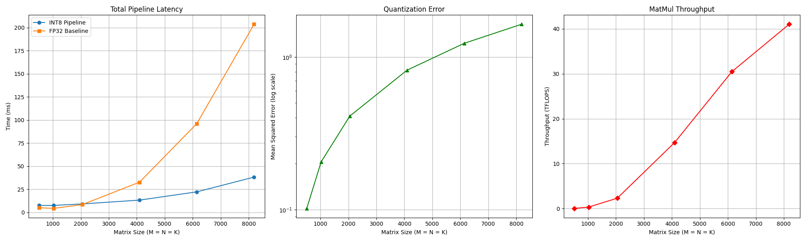

# cuQuant8

A high-performance CUDA implementation of **Symmetric (Absmax) Quantization** and **INT8 Matrix Multiplication**, leveraging NVIDIA Tensor Cores via `cuBLASLt`. This project demonstrates how to bypass standard FP32 bottlenecks to achieve massive throughput gains in deep learning inference.


## Performance Highlights

* **Isolated Kernel Throughput**: Reached a peak of **46.84 TFLOPS** at 8192x8192 dimensions, saturating the hardware compute blocks by isolating the execution from PCIe overhead.
* **End-to-End Speedup**: Achieved a **~5.5x** speedup over the standard `cuBLAS` FP32 baseline for large-scale matrices.
* **Massive Latency Reduction**: The entire INT8 pipeline (Quantize $\rightarrow$ MatMul $\rightarrow$ Dequantize) completes an 8192x8192 operation in just **~35ms**, compared to **~200ms** in FP32.
* **Memory Efficiency**: 4x reduction in weight memory footprint, enabling larger model deployments on consumer-grade hardware.

### Benchmark Analysis
The following graphs illustrate the complete performance profile of the implementation:

1. **Latency**: Demonstrates the 5x gap between our INT8 pipeline and standard FP32.
2. **Accuracy**: Tracks Mean Squared Error (MSE) to ensure numerical stability during the 8-bit squashing process.
3. **Throughput**: Shows the "True" hardware utilization of the isolated Tensor Core kernel.



## Features
* **Warp-Level Parallel Reduction**: A custom ``findAbsMax`` kernel that uses warp-shuffle intrinsics (``__shfl_down_sync``) to calculate quantization scales at the speed of the L1 cache.
* **cuBLASLt Hardware Heuristics**: Dynamically queries NVIDIA's heuristic engine to select the optimal tiling and wave-front strategy for the specific GPU architecture detected at runtime.
* **Custom Dequantization Kernel**: A specialized fused-multiply-add (FMA) kernel that handles the bit-shifting and scaling required to project 32-bit integer accumulators back into 32-bit floating-point space.
* **Isolated Benchmarking**: Precision timers utilizing ``cudaEvent_t`` to separate kernel execution time from memory management and PCIe transfer overhead.


## Hardware & Software Requirements
* **GPU:** NVIDIA GPU with Compute Capability 7.5+ (Turing, Ampere, Ada, Hopper) required for specific INT8 Tensor Core instructions.
* **OS:** Linux (Ubuntu) or WSL2.
* **CUDA:** Toolkit 11.8 or newer.
* **Compiler:** `nvcc` and `g++` (C++17).

## Build & Installation

### Standalone C++ Build (CMake)
The core CUDA pipeline is built using CMake. This compiles the custom kernels and links the `cuBLASLt` hardware APIs.

```bash
git clone https://github.com/brandonviaje/cuQuant8.git
cd cuQuant8

# Configure and build project
mkdir build && cd build
cmake ..
make

# Run individual test (pass a matrix dimension, default is 4096)
./cuQuant8 8192
```

### Python Benchmarking Suite
```bash
cd src

# make virtual env and install lib
python3 -m venv venv
source venv/bin/activate
pip install matplotlib

# run benchmark
python3 benchmark.py
```
