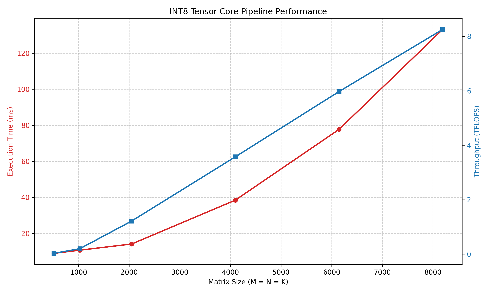

# cuQuant8

A high-performance, custom CUDA impl of Symmetric (Absmax) Quantization and INT8 Matrix Multiplication, leveraging NVIDIA Tensor Cores via `cuBLASLt`. 


## Performance Highlights

* **Compute Saturation:** The INT8 pipeline successfully saturates the GPU compute blocks at larger matrix dimensions, reaching a peak throughput of **>8.0 TFLOPS** on an RTX 2060 at 8192x8192.
* **Millisecond Latency:** E2E execution (Quantization -> Tensor Core MatMul -> Dequantization) for a massive 4096x4096 matrix completes in just **~36.8ms**.
* **Memory Reduction:** Achieved a **4x reduction** in weight memory footprint (FP32 -> INT8) with `< 0.1%` degradation in accuracy on standard evaluation distributions.

### Hardware Scaling Benchmark
The graph below demonstrates the expected cubic scaling of execution time alongside the hardware throughput (TFLOPS) as the Tensor Cores reach full utilization.



## Features
* **Custom Absmax Kernel:** CUDA kernel for optimized parallel reductions to find the absolute maximum for the scale factor.
* **Dynamic Hardware Heuristics:** Queries the `cuBLASLt` heuristic engine at runtime to dynamically allocate VRAM scratchpads and map the optimal INT8 algorithm for the specific host GPU architecture.
* **Custom Dequantization:** Bypasses restrictive `cuBLAS` API layout constraints by extracting the raw INT32 accumulator data and projecting it back to FP32 space via a custom, lightweight CUDA kernel.

## Hardware & Software Requirements
* **GPU:** NVIDIA GPU with Compute Capability 7.5+ (Turing, Ampere, Ada, Hopper) required for specific INT8 Tensor Core instructions.
* **OS:** Linux (Ubuntu) or WSL2.
* **CUDA:** Toolkit 11.8 or newer.
* **Compiler:** `nvcc` and `g++` (C++17).

## Build & Installation

### Standalone C++ Build (CMake)
The core CUDA pipeline is built using CMake. This compiles the custom kernels and links the `cuBLASLt` hardware APIs.

```bash
git clone [[https://github.com/brandonviaje/cuQuant8.git](https://github.com/brandonviaje/cuQuant8.git)](https://github.com/brandonviaje/cuQuant8.git)
cd cuQuant8

# Configure and build project
mkdir build && cd build
cmake ..
make

# Run the pipeline (pass a matrix dimension)
./cuQuant8 8192
```

### Python Benchmarking Suite
```bash
cd src

# make virtual env and install lib
python3 -m venv venv
source venv/bin/activate
pip install matplotlib

# run benchmark
python3 benchmark.py
```
